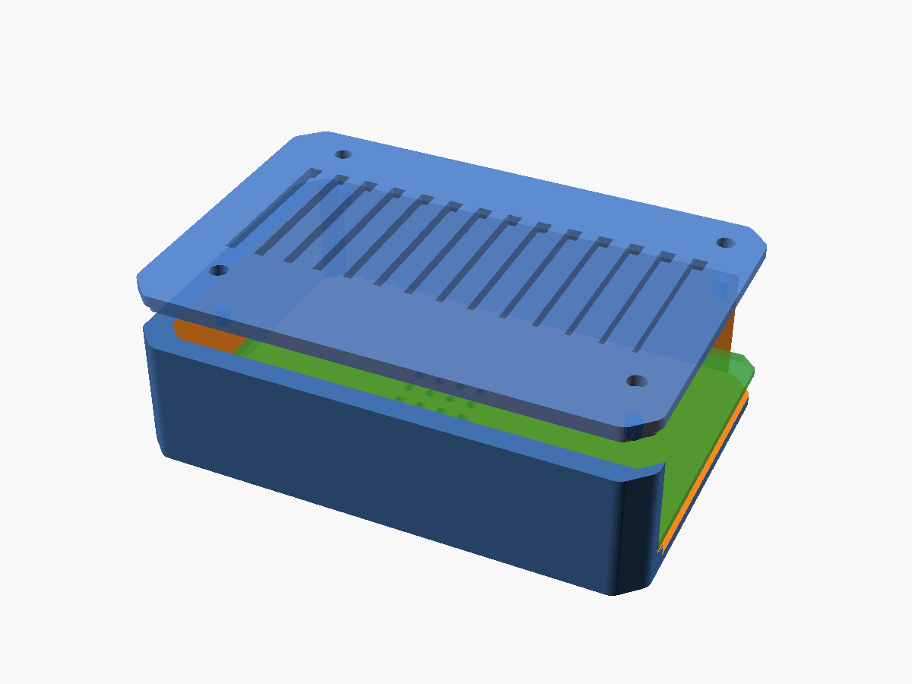

# RDK X5 Modular Case

> **The first open-source 3D-printable case for D-Robotics RDK X5 8GB.**
> Fully parametric OpenSCAD source. One base, three swappable lids.
> Licensed under **CC BY 4.0**.



## Why this exists

As of May 2026, RDK X5 has **no community 3D-printable case** on Printables,
Thingiverse, Cults3D, or English-language MakerWorld. The official metal/acrylic
cases from Yahboom, Waveshare, and DFRobot are heavy and don't fit inside
robot bodies. This repo fills that gap with a community-first, remix-friendly
modular design.

Originally built as a byproduct of [Project Korosuke (コロ助)](https://github.com/Robostadion/corosuke-robot),
an animatronic robot competing in the **D-Robotics Robotics Dream Keeper Challenge**.

## One base, three lids

| Lid | Preview | STL | Use case |
|-----|---------|-----|----------|
| **Default** (closed, cooling slits) |  | [`lid_default.stl`](stl/lid_default.stl) | Everyday use, dust protection, mild cooling |
| **Open** (frame + X ribs) |  | [`lid_open.stl`](stl/lid_open.stl) | Maker projects, full heatsink exposure, max airflow |
| **VESA Mount** (50×50 M4) |  | [`lid_vesa.stl`](stl/lid_vesa.stl) | 50 mm 4-hole bracket mount (board is too small for full VESA-75) |

Common base: [`case_base.stl`](stl/case_base.stl) — works with all three lids.


## Specifications

| Item | Value |
|------|-------|
| Compatible board | D-Robotics RDK X5 8GB (Part No. DROBOTICS-RDK-X5-8GB-V10) |
| Reference source | Official D-Robotics V1P0 DXF & STEP (`reference/`) |
| Case footprint | ~89 × 60 × 24 mm |
| PCB retention | Outer clamp (no PCB-side screws — preserves stock heatsink holes) |
| Lid attachment | 4 × M3 + 4 × locating pins |
| Designed material | PLA / PETG (2.0 mm wall) |
| License | CC BY 4.0 |

## Build (STL from source)

Requires [OpenSCAD](https://openscad.org/) 2021.01 or newer.

```bash
# Render all parts in one go
openscad -o stl/case_base.stl   -D 'SHOW=1' rdk_x5_case.scad
openscad -o stl/lid_default.stl -D 'SHOW=2' rdk_x5_case.scad
openscad -o stl/lid_open.stl    -D 'SHOW=3' rdk_x5_case.scad
openscad -o stl/lid_vesa.stl    -D 'SHOW=4' rdk_x5_case.scad
```

Or run `./build_all.sh` (Linux/macOS) / `build_all.ps1` (Windows).

## Print settings (suggested starting point)

| Parameter | Value |
|-----------|-------|
| Layer height | 0.20 mm |
| Walls / Perimeters | 3 |
| Top/Bottom layers | 4 / 4 |
| Infill | 20 % (gyroid) |
| Supports | **None needed** — designed support-free |
| Brim | Optional (5 mm) for warping-prone filaments |
| Filament | PLA, PETG, or PC-blend; ABS optional |

## Customization

Open `rdk_x5_case.scad` and edit the `// PARAMETERS` block. Useful knobs:

| Variable | Default | When to change |
|----------|---------|---------------|
| `PCB_FIT_GAP` | 0.4 mm | Reduce to 0.3 for snug fit, raise to 0.6 if too tight |
| `TOP_CLEAR` | 18 mm | Increase to 25 mm if using a tall heatsink + fan |
| `WALL` | 2.0 mm | Drop to 1.6 for ABS, raise to 3.0 for TPU |
| `VESA` | 50 (50×50 M4) | Max that fits on the 56 mm-deep lid; an assert guards against overhang |
| `SLIT_W`, `SLIT_GAP` | 2.5, 3.0 | Tune slit density on Default Lid |

## Roadmap

- [x] Default Lid — closed + cooling slits
- [x] Open Lid — frame with X-cross ribs
- [x] VESA Mount Lid — 50×50 M4 pattern (bosses fully supported on the lid)
- [x] Accurate port cutouts — every connector position extracted from the
      official STEP model and verified against the real board mesh
      (USB-A ×2, RJ45, HDMI, audio, USB-C ×2, 40-pin GPIO, microSD, fan).
      See [connector_map.md](connector_map.md) and
      `images/board_fit_verification.png`.
- [ ] Camera Lid — MIPI CSI cable pass-through (planned)
- [ ] DIN-rail Lid — industrial mount (community request welcome)
- [ ] Print validation on real hardware (PLA / PETG)
- [ ] Thermal validation under load

## Disclaimer

This is an unofficial community design. Not affiliated with or endorsed by
D-Robotics. PCB outline geometry is derived from D-Robotics' publicly
released DXF/STEP mechanical drawings (`reference/`); those original CAD
files remain the property of D-Robotics and are included for design
verification only.

## License

**CC BY 4.0** — see [LICENSE](LICENSE). You may share and adapt freely,
including commercially, as long as you give credit.

## Acknowledgments

- **D-Robotics** for publishing the mechanical reference files openly.
- **Lisa Li** and the Robotics Dream Keeper Challenge team for the warm welcome.
- The Korosuke / コロ助 character from *Kiteretsu Daihyakka* — the spark
  for this entire project.
